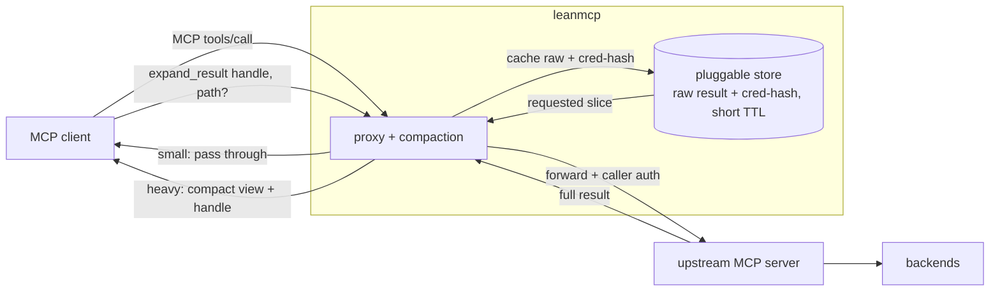
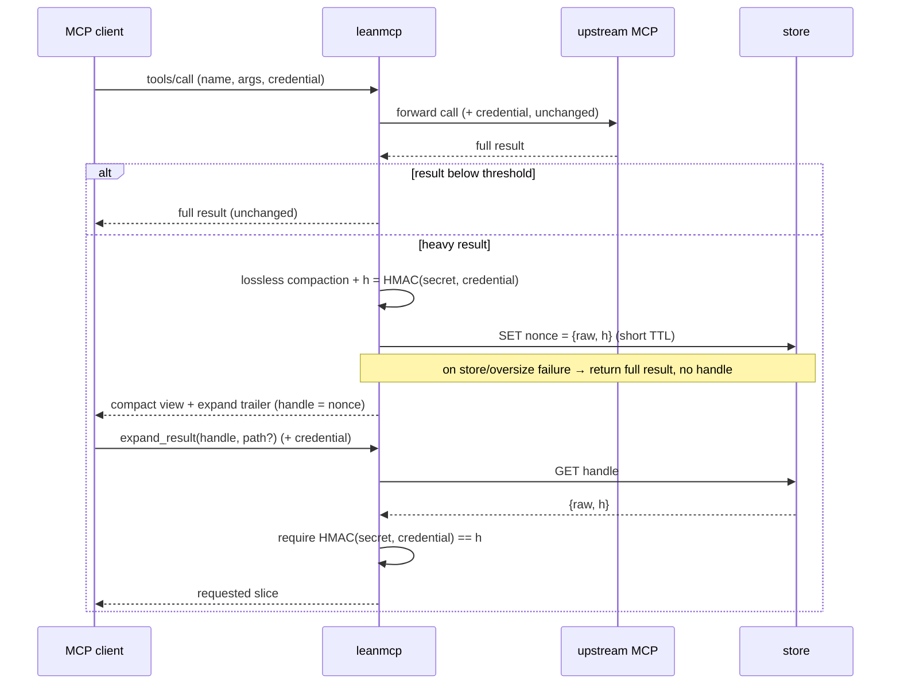

# leanmcp — Design

**Date:** 2026-06-21
**Status:** Approved design, pre-implementation
**Module:** `github.com/mayur-tolexo/leanmcp`

## 1. Problem

MCP tool-call results are injected verbatim into a model's context. List/search and
other data-heavy responses dominate token usage: a single 100-row JSON response is
easily 15K tokens, and the model pays for the whole thing on every call even when it
needs a fraction of the data. The cost is paid on the *response* path, repeatedly,
across every agent run.

We want to cut that cost **without modifying any existing MCP server or API**.

## 2. Goal & non-goals

**Goal:** A standalone, generic proxy that sits between an MCP client and any upstream
MCP server and reduces the tokens that *tool-call results* add to the model's context —
losslessly by default, with full data recoverable on demand.

**Non-goals (v1):**
- Optimizing the `tools/list` catalog (tool schemas/descriptions). Out of scope.
- LLM-based summarization of results. Deliberately excluded — see §9.
- Lossy field projection enabled by default. Available but opt-in per tool — see §6.2.

## 3. Approach

A **transparent MCP-to-MCP proxy**. It is an MCP *server* (Streamable HTTP) to the
client, and an MCP *client* to one configured upstream MCP server. The client points
its MCP config at leanmcp instead of at the upstream; nothing else changes.

For each tool call, leanmcp forwards to the upstream, inspects the result, and:
- **passes small results through untouched** (only optimize "where usage is maximum"), or
- for **heavy** results, returns a **compact, losslessly-transformed view** plus a
  trailer telling the model it can retrieve the full payload — or a sub-path — via an
  injected `expand_result` tool. The full raw result is cached in a pluggable store
  behind a short-TTL handle **bound to a keyed hash of the caller's credential**.

leanmcp **does not verify or interpret the credential** — it forwards it to the upstream
unchanged (the upstream remains the sole auth/authz authority). The credential hash is
used only to gate `expand_result`: a handle can be redeemed only by presenting the same
credential that created it (see §8.1).



### 3.1 Why a separate, generic service
- Truly "no changes to existing APIs" — it is pure infrastructure in front of any MCP server.
- Reusable beyond any single platform (works with any MCP server, not provider-specific).
- Because it never interprets the credential, it works with **any company's auth system**
  with zero integration.
- Reuses well-understood building blocks: official MCP go-sdk, Streamable HTTP, a
  context-forwarding `http.RoundTripper`, a pluggable store (Redis reference impl).

## 4. Per-method behavior

| MCP method | Behavior |
|---|---|
| `initialize` | Forward to upstream; return upstream capabilities; advertise leanmcp's own server info. |
| `tools/list` | Fetch the **full** upstream list, append the wrapper-owned `expand_result` tool, and **re-paginate locally** under leanmcp's own cursor. Upstream cursors are never passed through after a merge (see §8.2). |
| `tools/call` → `expand_result` | Handled **locally** from Redis. Never forwarded. |
| `tools/call` → any other tool | Forward (with caller auth) → receive full result → classify → pass through if small, else compact + cache + trailer. |

### 4.1 `tools/call` sequence



## 5. Components

### 5.1 Frontend MCP server
go-sdk `StreamableHTTPHandler`, stateless JSON mode. Receiving middleware intercepts
`initialize`, `tools/list`, `tools/call`. The inbound HTTP `Authorization` header is
captured and threaded into the upstream client call via context.

### 5.2 Upstream MCP client
A go-sdk client (`StreamableClientTransport`) to `UPSTREAM_MCP_URL`. Per-request auth is
injected with a custom `http.RoundTripper` that reads the caller's credential from
context and attaches it to the outgoing request — the pattern shown in the go-sdk's own
`examples/server/proxy`. The upstream still performs all of its own auth/authz.

### 5.3 Credential binding (no verification — see §8.1)
leanmcp does **not** verify or interpret the credential. It reads the inbound
`Authorization` header, forwards it to the upstream unchanged, and computes
`HMAC(cache_secret, credential)` purely to **bind cache handles**. The hash is stored
with the cached entry; `expand_result` is honored only when the caller presents a
credential whose hash matches. This needs no per-company auth integration and makes no
authorization decisions — the upstream remains the sole authority.

### 5.4 Result classifier ("where usage is maximum")
Estimates result token cost (char-count ÷ ~4, or a real tokenizer) and compares against
`optimize_threshold_tokens`. Below threshold → untouched pass-through. Always emits
per-tool size telemetry so heavy tools can be identified and tuned.

### 5.5 Compaction engine (lossless, the v1 core)
Config-driven via `leanmcp.yaml`, keyed by upstream tool name. v1 modes:
- **`tabular`** — for arrays of uniform objects, emit one header + rows instead of
  repeating keys per element. Largest, lossless win (~60–75% on list responses).
- **`dedupe-keys`** — collapse repeated structural keys in nested/heterogeneous data.
- **`none`** — pass through (default for tools with no rule, if above threshold, gets a
  generic safe transform or is simply cached with a full-result handle).

All v1 transforms are **lossless**: every field and item is preserved either in the
compact view or reconstructable from it. No data is dropped without a handle to recover it.

### 5.6 Pluggable store (Redis reference impl)
The store is an interface (see §14); Redis is the reference implementation, with an
in-memory impl for tests/single-node. A company can supply its own (S3, an internal
cache, a DB) by implementing two methods.
- Key: random `nonce` (the handle). Value: `{raw, cred_hash, created_at}`.
- **Short TTL** (default 5–15 min); Redis impl uses `volatile-ttl`/`allkeys-lru` eviction.
- `max_raw_bytes` per handle. Oversized payloads are **not** cached (see §7).

### 5.7 Injected `expand_result` tool
```jsonc
{
  "name": "expand_result",
  "description": "Retrieve the full or partial raw result of a prior compacted tool call.",
  "inputSchema": {
    "handle": "string (required)",
    "path":   "string  // optional dot-path, e.g. 'data[3].pricing'",
    "fields": "string[] // optional whitelist of dot-paths",
    "offset": "integer // optional, page a capped array",
    "limit":  "integer // optional"
  }
}
```
Loads raw from the store, requires `HMAC(cache_secret, caller_credential)` to equal the
entry's stored hash (§8.1), then applies `path`/`fields`/`offset`/`limit` and returns the
slice (re-compacted if still huge, same handle reusable). Missing/expired handle or a
credential-hash mismatch → the same clear error: "result expired, re-run the original
tool" (mismatch is not distinguished, to avoid leaking handle existence).

### 5.8 Compact-result trailer
A small machine-readable footer so the model knows expansion exists, e.g.:
```
[leanmcp: showing 20 of 412 items, lossless tabular form]
[expand: expand_result(handle="r_8f3a", offset=20) for more;
         expand_result(handle="r_8f3a", path="data[0]") for a full record]
```

## 6. Configuration

### 6.1 Global (`leanmcp.yaml`)
```yaml
version: 1
upstream_mcp_url: ${UPSTREAM_MCP_URL}
cache_secret:     ${CACHE_SECRET}   # HMAC key for credential binding
store:
  type: redis                       # redis | memory (factory-selected, §14)
  redis_url: ${REDIS_URL}
optimize_threshold_tokens: 1500     # below this, never optimize
expand_ttl: 10m
max_raw_bytes: 5_000_000
shadow_mode: true                   # compact AND return full; log would-be savings
```

### 6.2 Per-tool
```yaml
tools:
  some-list-tool:
    compaction: tabular
    array: { path: data, max_items: 50 }   # cap is lossy → recoverable via expand offset/limit
    # projection is OPT-IN and OFF by default; enable only after telemetry shows low expand rate
    keep_fields: [id, name, status]        # optional, lossy
```

## 7. Error handling / fail-open

Every failure preserves correctness by returning the **full result**:

| Failure | Behavior |
|---|---|
| Redis down / write fails | Return full result, **no handle issued**. |
| Payload > `max_raw_bytes` | Return full result, **no handle** (never issue a handle with no backing data). |
| Upstream error | Pass through untouched — never optimize errors. |
| `expand_result` handle missing/expired/cred-hash mismatch | Same clear error: "result expired, re-run the original tool." |
| No credential present (unauthenticated upstream) | Bind to the empty-credential hash; handles are shared, acceptable since there are no secrets to protect. |

## 8. Hard parts (from design review) and resolutions

### 8.1 Handle isolation without verification — CRITICAL
A handle returned to the model could be observed and redeemed by another caller, leaking
one caller's cached data to another. An earlier approach verified the credential to derive
an `org/user` namespace — but that drags per-company auth integration into a proxy that
otherwise interprets nothing. **Resolution:** bind each handle to `HMAC(cache_secret,
credential)` and require a matching credential on `expand_result`. The security argument:
**the cache grants no access the credential didn't already have** — the cached data is a
subset of what that exact credential just fetched from upstream, and anyone holding the
credential could simply call the original tool again. So "redeem only with the same
credential" is the correct boundary and is strictly weaker than the credential's own
power. The short TTL bounds the post-revocation window (a revoked-but-known credential
string could redeem a still-cached handle until it expires; acceptable for minutes-scale
TTLs, and the data is again only what that credential already saw). This needs no auth
integration and works with any upstream auth scheme.

### 8.2 `tools/list` cursor pagination — HIGH
Upstream paginates with opaque offset/limit cursors; appending `expand_result` to a
paginated page corrupts the cursor chain. **Resolution:** fetch the full upstream list,
merge, and **re-paginate locally** under leanmcp's own cursor. Never forward upstream
cursors after a merge.

### 8.3 LLM summarization is net-negative — EXCLUDED from v1
A separate cheap-model call consumes the *full* payload as input to save context on the
main model; with realistic price ratios (~3.75× cheaper, not ~10×) it is roughly
break-even, adds 0.5–2s latency, and risks the MCP timeout if synchronous.
**Resolution:** not in v1. If ever added: async-only and opt-in.

### 8.4 Lossy projection backfire — DEFERRED / opt-in
Dropping a needed field forces an expand round-trip, which can be net-negative once the
expand rate exceeds ~20%. **Resolution:** v1 core is lossless; projection is opt-in
per tool, enabled only after telemetry confirms a low expand rate.

## 9. Token-savings estimate

Heavy response baseline: ~100-row list ≈ 60 KB ≈ **15K tokens**.

| Strategy | Compact size | Savings if no expand |
|---|---|---|
| Tabular compaction (lossless) | ~5–6K | ~60–65% |
| + opt-in projection (~6/20 fields) | ~3K | ~80% |

Net per heavy call ≈ `(1−e)·saving − e·penalty`, expand penalty ≈ +3.5K vs baseline:

| Expand rate `e` | Net savings (with projection) |
|---|---|
| 10% | ~70% |
| 20% | ~59% |
| 40% | ~39% |

**Workload level:** heavy responses ≈ 20% of calls but ≈ 75% of response tokens.
Optimizing only those at a safe ~50–55% net → **~40% reduction in total tool-response
tokens**, up to **45–70%** if expand rate stays under ~15%. Lossless-only (no projection)
is the floor: ~50% on heavy responses with effectively no downside.

## 10. Observability

Prometheus metrics, per-tool labels: `result_bytes_original`, `result_bytes_compacted`,
`compaction_ratio`, `expand_total` / **expand_rate** (key tuning + shadow-mode signal),
`fallback_total{reason}`, `store_latency`, `added_latency`. Audit log on every
`expand_result`: `(cred_hash_prefix, handle, outcome)` — the credential hash prefix, never
the credential itself.

## 11. Rollout

1. **Shadow mode** — compact *and* still return the full result; log original-vs-compact
   size and the would-be expand rate. Run 1–2 weeks.
2. Flip to **handle-only** per tool once that tool's expand rate is <~15%.
3. Consider opt-in projection for tools with consistently low expand rate.

## 12. Deployment

Standalone service; container + K8s Deployment/Service. Multi-replica (state lives in the
store), pre-stop drain. New infra: a store backend (Redis by default) and egress access to
it + the upstream MCP. `cache_secret` provided as a secret. Config via env / `leanmcp.yaml`.

## 13. Open questions

- Tokenizer choice for the classifier (heuristic vs. exact) — start heuristic.
- Whether `expand_result` results should themselves be compactable (recursion) or always raw.

## 14. Extensibility

The two integration seams are **public, importable** Go packages with narrow,
dependency-free interfaces, so a company can integrate by implementing one of them and
either configuring it or constructing the server as a library.

- **Store** (`store.Store`): `Put(ctx, credHash, raw, ttl) → handle` and
  `Get(ctx, handle) → Entry`. Reference impls: `memory`, `redis`. A `type` string in
  config selects the backend via a small factory; bring-your-own backends (S3, internal
  cache, DB) implement these two methods.
- **Server construction** (`proxy.NewServer`): accepts the `Store` (and upstream client)
  as parameters, so a library user passes their own implementation directly — no fork.

Auth is intentionally **not** a seam: leanmcp never interprets the credential, so there is
nothing company-specific to plug in (this replaced the earlier `Verifier` interface; see
§8.1). A `docs/extending.md` guide shows a minimal custom `Store`.
